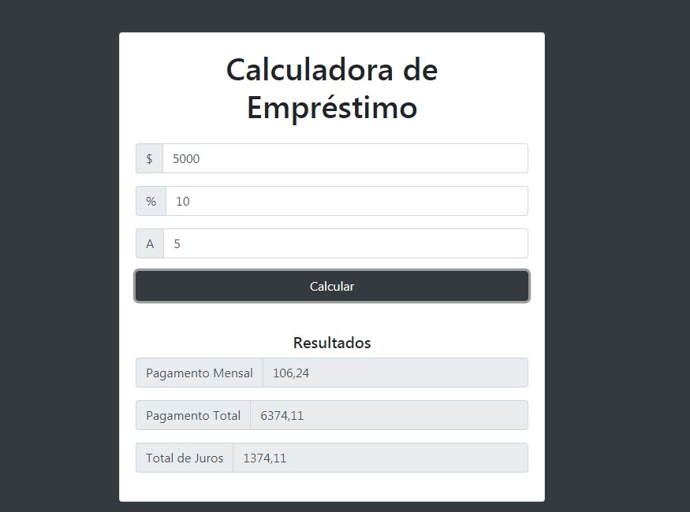

<h1 align="center">
  Calculadora de Empréstimos
</h1>

## 📋 Índice

- [Preview](#-Preview)
- [Sobre](#-Sobre)
- [Tecnologias utilizadas](#-Tecnologias-utilizadas)
- [Como executar o projeto](#-Como-executar-o-projeto)

---

## 🖥 Preview

  

---

## 📖 Sobre 

Exercício proposto para manipulação de DOM no curso "Modern JavaScript From The Beginning" do professor Brad Traversy. Neste exercício foi criada uma calculadora de empréstimos com as informações de valor para empréstimo, taxa de juros e quantidade de anos para pagar. 

---

## 🚀 Tecnologias utilizadas
O projeto está sendo desenvolvido com as seguintes tecnologias:
- HTML5
- Bootstrap
- JavaScript

---

## ⌨ Como executar o projeto

Baixe o arquivo .ZIP do projeto e após descompactar abra com seu navegador o arquivo index.html.
